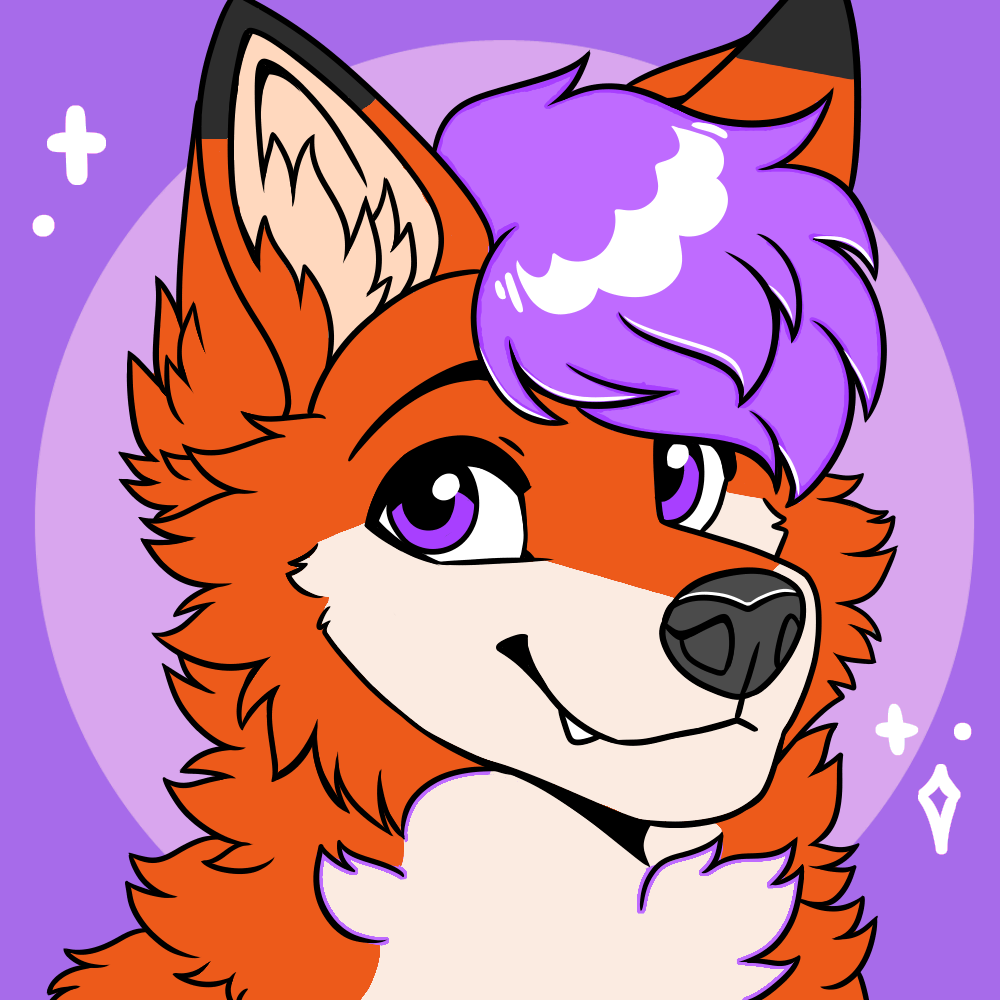

  

## Hey there! 👋  

I'm a **hobbyist developer** specializing in backend application development. I work on servers, databases, and backend software, with experience in:  

### Tools & Technologies 🛠️ 
- **Programming:** Java, SQL, Python and C 
- **Frameworks & Platforms:** Spring, Hibernate, Docker  
- **Virtualization:** Proxmox, OPNsense  
- **Frontend Basics:** HTML, CSS, JavaScript, Vue, and Figma for interface design  

### What I Do 🧑‍🏭 
- Backend apps, Discord bots, and game mods (e.g., Minecraft)  
- Custom full-stack applications (e.g., payment integration)  
- Server hosting, networking, and security  

### About Me 💁 
- Native German speaker, fluent in English  
- Interests: Furry fandom, gaming, app development and spending time with friends  

  
*“Code is like humor. When you have to explain it, it’s bad.” – Cory House*
  
### Support My Projects 💸 
If you'd like to support my work, consider donating via crypto:  

BTC

  
`bc1qwwnh24q4r36r5q2ad6wvr3q2s4gfn72c82ekdf`

ETH

  
`0x95b63d005da369fA0919EBa8CD1e2497B7C93CA2`

XMR

  
`496q2jhA2YyPavbZTx6ophXJQaWLPhoawF3kBP3vFdnY3Ew5ZNLHfh651VmAC7q6ZUhg9uGYGz1QZJB1nz7iueQj6qNpWqy`

## Statistics

